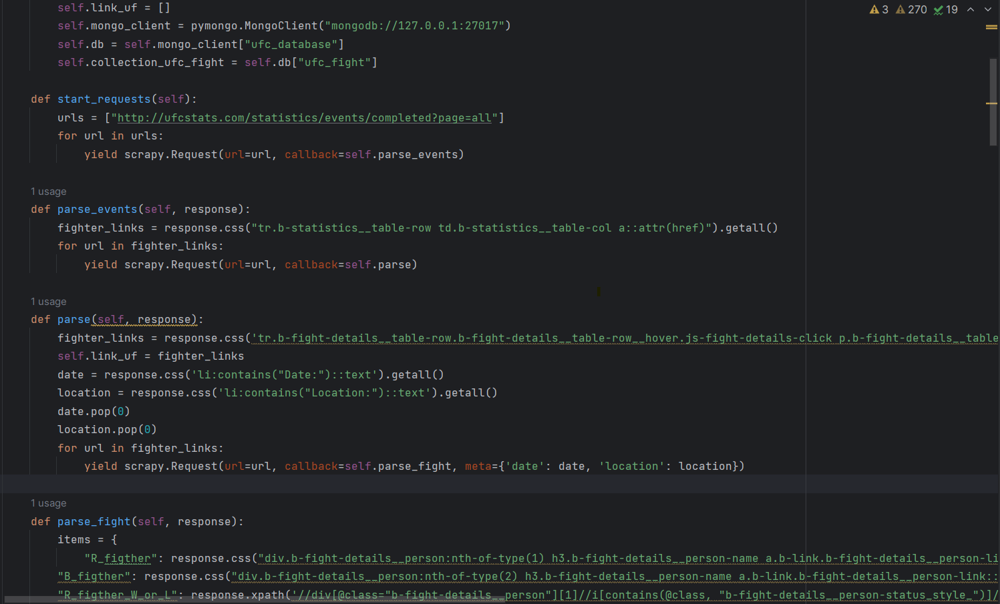
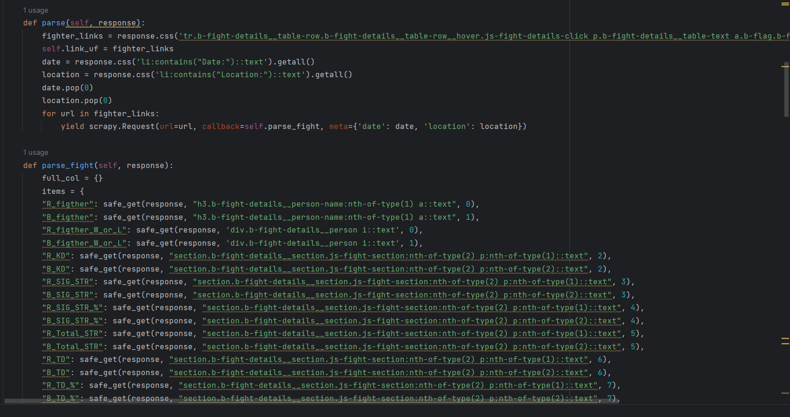
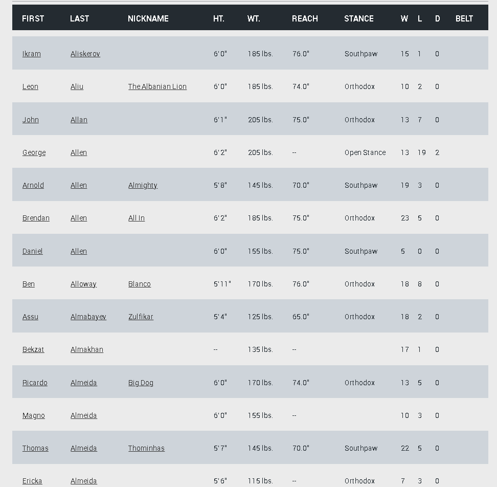

# UFC Data Projet 

Ce dépôt contient deux codes de Scrapy qui sont intégrés à MongoDB puis traités, mais aussi un tableau de bord avec une barre de recherche implémentée grâce à Elasticsearch, dans un cadre d'application web Python. Le tableau de bord fournit des informations et des analyses sur l'Ultimate Fighting Championship (UFC) entre 1993 et 2024. Les utilisateurs peuvent explorer diverses visualisations et données relatives aux matchs de l'UFC, aux combattants, etc.

## Guide utilisateur 
docker-compose up --build

## Guide Développeur 

Language : python

FrameWork : Dash plotly, MongoDB, Elasticsearch
 
IDE recommandé : Vscode, Docker 

## 	Architecture du code 

## Qu'est-ce que l'UFC ?

### Ultimate Fighting Championships :

L'Ultimate Fighting Championship, communément appelé l'UFC, est la plus grande organisation mondiale de combat libre (Mixed Martial Arts, MMA). Fondée en 1993, l'UFC a radicalement transformé le paysage des sports de combat en offrant une plateforme où les combattants de différentes disciplines martiales peuvent se mesurer dans un environnement sans restriction.

## Introduction
Pour ce projet, nous avons décidé de scraper le site de l'UFC car nous sommes passionnés par les sports de combat. Voici l'URL concernée : 
"http://ufcstats.com/statistics/events/completed".

### Scrapy

Nous avons commencé par scraper les données des combattants, c'est-à-dire toutes leurs caractéristiques. Pour cela, nous avons utilisé le code suivant :

- Photo du code Scrapy 1:

Ensuite, nous avons effectué un deuxième scrapy afin de récupérer les données des combattants.
- Photo du code Scrapy 2 :
 

Dans ces scripts, nous parcourons plusieurs pages et scrap les données qui nous intéressent. Ensuite, nous procédons à un nettoyage des données pour les rendre plus lisibles et plus simples à analyser. À chaque appel récursif, nous intégrons les données dans notre base de données MongoDB, même si, après analyse, cette solution ne semble pas la plus adaptée en raison de sa complexité.

Nous avons effectué plusieurs améliorations dans notre script Scrapy. Dans le `DC_spider`, nous avions initialement effectué un nettoyage de données trop agressif, ce qui a entraîné une perte significative de données. Après avoir allégé cette étape, nous sommes passés de 3500 lignes et 135 colonnes à 6500 lignes, et après quelques améliorations, à 7133 lignes.

Pour améliorer notre script Scrapy, nous avons pris plusieurs mesures :
1. Nous avons mis en place un bulk pour l'intégration des données dans MongoDB, ce qui a réduit le temps de traitement de 2.89 secondes à 2.74 secondes par page scrapée.
2. Nous avons ajusté les paramètres `CONCURRENT_REQUESTS` et `CONCURRENT_REQUESTS_PER_DOMAIN` et trouvé que les valeurs 32 et 5, respectivement, offraient les meilleurs résultats, réduisant le temps de traitement à 1.77 secondes.
3. Nous avons introduit une fonction `safe_get` pour gérer les cas où un combattant est mis KO, évitant ainsi des erreurs dues à l'absence de données. Cependant, cette modification n'a pas amélioré les performances comme espéré, et le temps de traitement est remonté à 2.60 secondes.

Au final nous avions un code qui ressemble a cela comme nous n'avons pas eu le temps de l'intégrer dans notre projet nous avons décidé de mettre le fichier python dans le dossier vous pourrez le parcourir voici un aperçue:

Faute de temps, nous n'avons pas pu intégrer la version améliorée du script à notre projet en raison d'une petite erreur dans le code qui affectait le bulk, nous laissant avec un dataset de 7222 lignes et une colonne.

### Nettoyage des données

Nous avons commencé par nettoyer les données en retirant tous les caractères spéciaux. La première étape consistait à nettoyer la colonne `class` pour la remplacer par des catégories, ce qui s'est avéré relativement simple car les données étaient bien structurées. Après, nous avons remplacé les différentes valeurs manquantes par catégorie de poids, ce qui est plus précis.

L'un des plus grands défis que nous avons rencontrés dans ce projet est la transformation des données de localisation en latitude et en longitude, ce qui a pris énormément de temps. Nous avons réglé ce problème en créant une liste regroupant toutes les localisations car il n'y avait que 182 localisations uniques pour 7222. Il est inutile de parcourir le dataset ligne par ligne pour actualiser les longitudes et latitudes, cela nous fait juste perdre des performances.

Le plus gros du travail a concerné le dataset sur les caractéristiques des combattants, qui était moins bien structuré. Beaucoup de valeurs manquantes étaient dues à une mauvaise documentation sur le site de l'UFC. 

Voici a quoi cela pouvait ressembler:

On peut y voir des données manquantes réparties un peu partout. Pour gérer tout cela, nous avons d'abord créé une nouvelle variable `class` afin d'affiner notre nettoyage. De plus, grâce au premier dataset, une variable `gender` a été ajoutée pour plus de précision.

Pour gérer les données manquantes sur la taille et l'allonge, nous avons remplacé les valeurs manquantes en utilisant la corrélation entre ces deux mesures. Face à la difficulté de remplacer précisément le poids, nous avons opté pour un modèle de machine learning avec une précision de 70%, ce qui est satisfaisant étant donné que l'optimisation maximale n'était pas l'objectif principal de ce projet.

### App Dash

### Docker 

Enfin, nous sommes passés à la conteneurisation de notre code, qui a été plus difficile que prévu. Nous avons utilisé un Docker Compose pour relier toutes les autres images que nous avons dû utiliser, telles que MongoDB, Elasticsearch, etc., que nous avons dû configurer sur différents ports. Nous avons été surpris de voir que nos codes Scrapy ont pris beaucoup plus de temps à s'exécuter, ce qui s'explique par une allocation différente de puissance. Nous avons donc augmenté la puissance allouée à notre conteneur. Après cela, nous avons écrit les différents Dockerfile dans tous les fichiers où cela était nécessaire.

### Copyright 

Nous avons utilisé ChatGPT pour certaines corrections de code :

https://docs.scrapy.org/en/latest/intro/tutorial.html
https://dash.plotly.com/tutorial
https://www.mongodb.com/languages/python
https://dylancastillo.co/elasticsearch-python/

# Conclusion 

Cette première version de notre projet en Data engineering  dédiée à l'UFC représente une première plongée dans le monde riche des arts martiaux mixtes. Cependant, comme toute initiative initiale, subsiste le potentiel d'amélioration et d'expansion.

L'inclusion des modifications dans le spider, et plus encore l'amélioration de l'application ainsi que la gestion des données, nous offre énormément d'axes d'amélioration.

En espérant vous avoir communiqué notre passion pour les arts martiaux ! Merci pour votre lecture !

